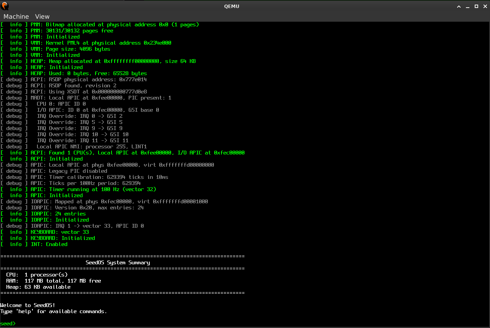

# SeedOS

A modern 64-bit Intel operating system built from scratch in C and assembly. SeedOS uses contemporary OS design: UEFI boot, APIC-driven interrupts (no legacy PIC), 4-level paging with per-process address spaces, preemptive multitasking, copy-on-write fork, ELF binary loading, and a Unix-style syscall interface -- all running in long mode with a higher-half kernel.



## Current Status

SeedOS boots via UEFI, launches a userspace shell, and can run standalone C programs (ls, cat, grep, sort, etc.). The source tree follows Linux kernel conventions.

### Features

**Boot & Hardware**
- UEFI boot via Limine bootloader protocol v3
- Higher-half kernel at `0xFFFFFFFF80000000`, HHDM at `0xFFFF800000000000`
- Local APIC + I/O APIC (no legacy 8259 PIC)
- ACPI table parsing (RSDP, RSDT, XSDT, MADT)
- PS/2 keyboard with interrupt-driven input
- Serial port (COM1) for debug output and interactive shell input (IRQ-driven RX)
- Framebuffer graphics with 8x16 bitmap font

**Memory Management**
- Physical Memory Manager (PMM) - bitmap-based page allocator
- Virtual Memory Manager (VMM) - 4-level paging (PML4/PDPT/PD/PT)
- Per-process address spaces with kernel mapped in upper half
- Heap allocator (kmalloc/kfree/krealloc)
- Copy-on-write (COW) page fault handling for fork

**Process Management**
- Preemptive round-robin scheduler
- Process states: unused, ready, running, blocked, zombie
- fork() with COW, waitpid(), spawn()
- ELF64 loader for userspace binaries
- Per-process file descriptor tables and working directories

**Syscalls (22 implemented)**
- File I/O: open, read, write, close, lseek, stat, fstat, dup, dup2
- Directory: getdents, getcwd, chdir
- Process: exit, getpid, fork, waitpid, spawn, spawn_async
- System: uptime, sbrk, isatty, shutdown, reboot

**Virtual Filesystem**
- VFS layer with path resolution
- Tar archive filesystem (files embedded in kernel image)
- Per-process file descriptor management

**Userspace**
- C library (stdio, stdlib, string, unistd, dirent, ctype)
- Interactive shell with command execution and piping
- User programs: ls, cat, echo, pwd, clear, head, tail, wc, grep, sort, uniq, tr, hexdump, seq, stat, info, uptime, shutdown, reboot

**Kernel Infrastructure**
- Full IDT with 256 entries, hardware IRQ routing through I/O APIC
- Kernel threads with preemptive or cooperative scheduling
- Synchronization: spinlocks, mutexes, condition variables
- Kernel shell (kshell) as fallback interface
- Framebuffer console with scrollback, cursor blinking, boot logo

## Building

```bash
make          # Build bootable ISO
make run      # Run in QEMU with serial to stdout
make debug    # Run in QEMU with GDB server
make clean    # Remove build artifacts
make compdb   # Generate compile_commands.json for clangd
```

Requires: `xorriso`, `qemu-system-x86_64`, OVMF firmware at `/usr/share/ovmf/OVMF.fd`.

## Project Structure

```
seedos/
├── arch/x86/       # x86-64 specific: boot, ACPI, APIC, IDT, ISRs, GDT
├── kernel/         # Core: kprintf, kshell, kthread, sync, scheduler, process
├── mm/             # Memory management: PMM, VMM, heap
├── fs/             # Filesystems: VFS, tarfs
├── drivers/        # Device drivers: tty (console, serial), input (keyboard)
├── init/           # Kernel entry point (main.c)
├── include/seedos/ # Global headers
├── lib/            # Utilities (logo, sysinfo)
├── userspace/      # User programs and libc
├── scripts/        # Build helper scripts
└── build/          # Build output
```

## Documentation

Full documentation lives in [`docs/`](docs/):

- 📖 **[The SeedOS Book](docs/book/README.md)** — complete narrative guide to how
  the OS works and is built ([table of contents](docs/book/SUMMARY.md)).
- 📑 **[Reference notes](docs/reference/)** — terse per-subsystem references.
- 🧭 **[Plans](docs/plans/)** — design & bring-up docs (userspace, BusyBox, fork).

## Not Yet Implemented

- Multi-CPU/SMP support
- Writable filesystem / disk I/O
- Pipes and I/O redirection
- Signal handling
- Network stack
